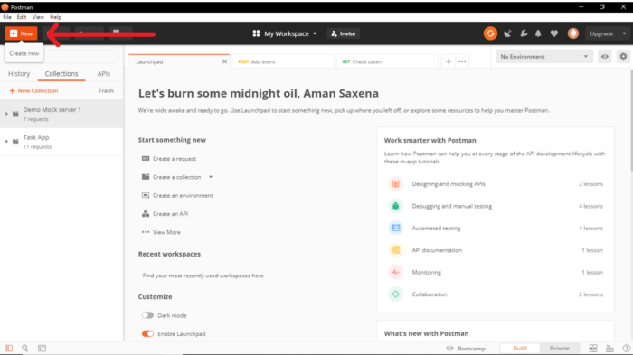
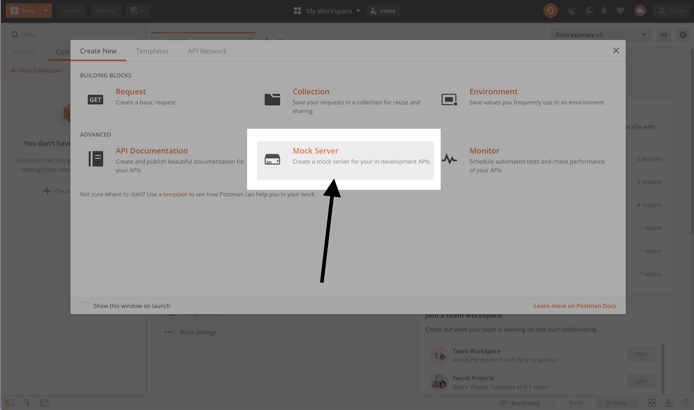
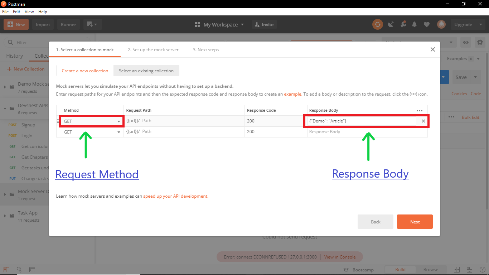
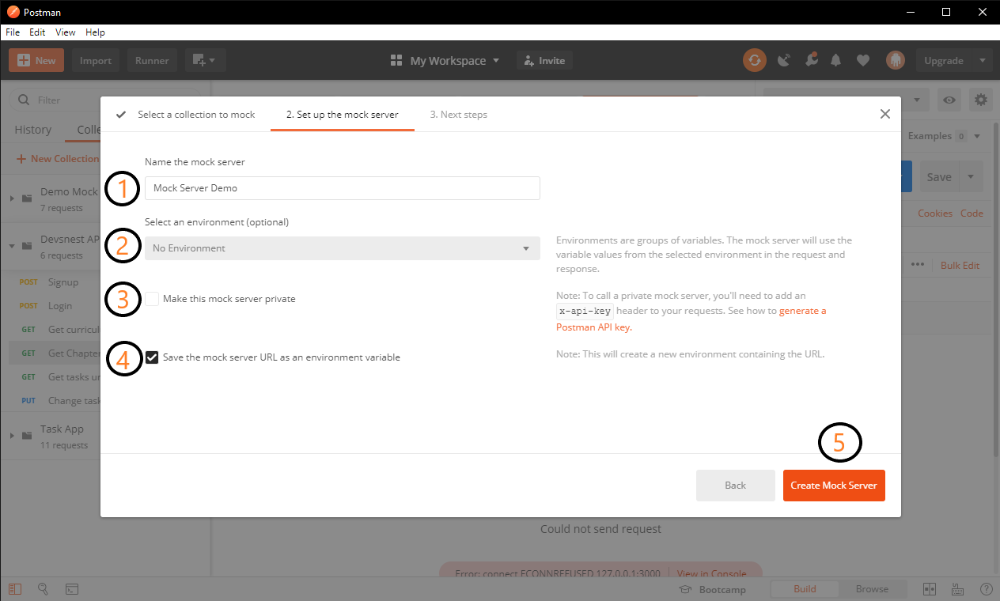
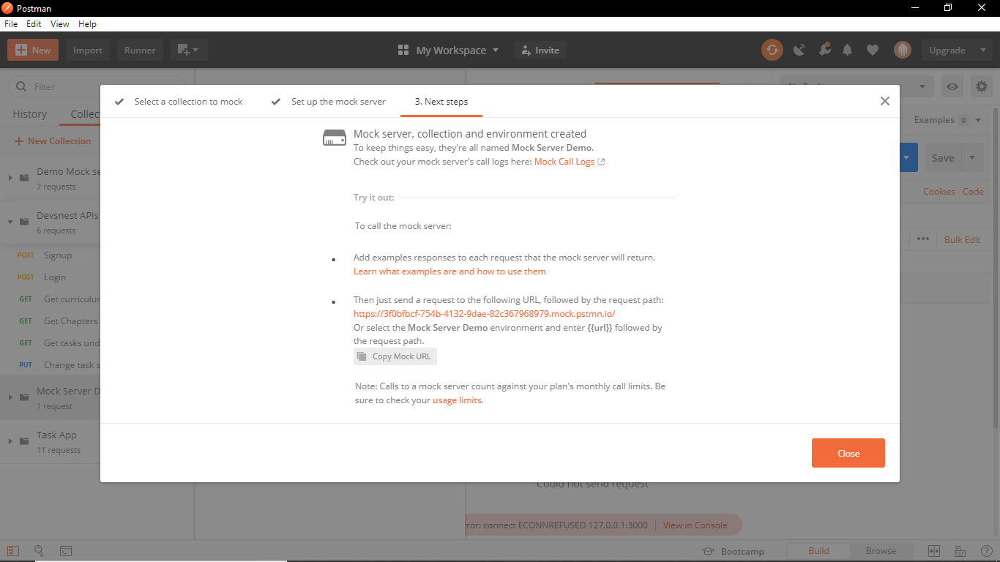
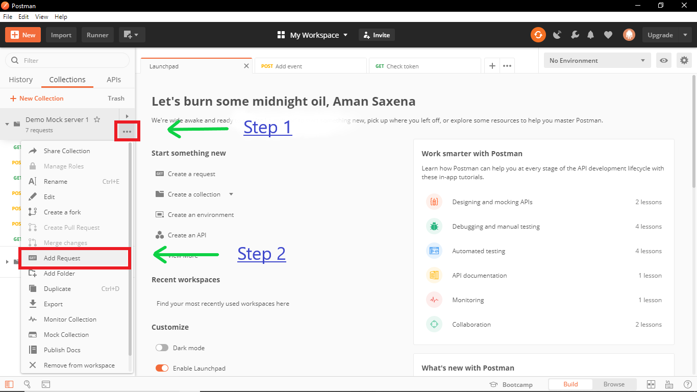
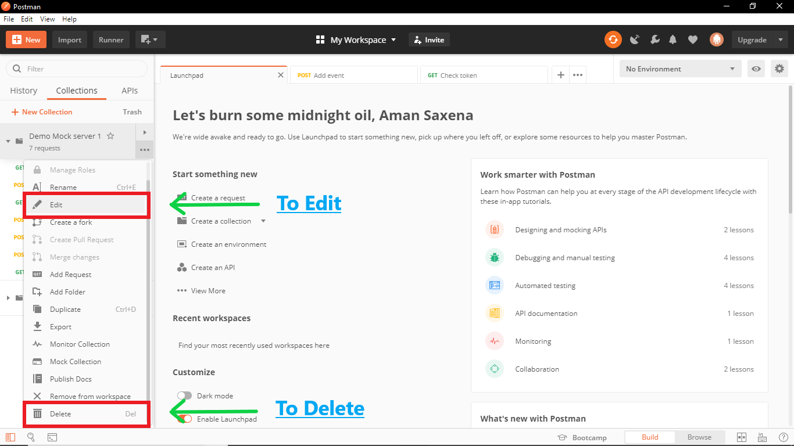

# How to Create Your First Mock Server

 - One of the most fundamental parts of contributing to open-source projects is working as a group and handling a large number of files across every development stage. These stages consist of several APIs calls requesting various information through GET/POST methods which require a functioning server. But what happened when you do not have full backend support yet or no running APIs in the development stage? You end up to square one & hence, not able to set up a server eventually. Here comes the magical feature of Postman to create a dummy server aka Mock Server to your aid.

 - This guide includes step-by-step instructions, so that you have a comfortable experience in beginning your open source deployment. Without further ado, let's get started by answering all the why(s), what(s) & how(s)!

## What is Mock Server?

 - Mock Server allows you to simulate your API data. When MockServer receives a request it matches the request against active **expectations** that have been configured, if no matches are found it proxies the request if appropriate otherwise a 404 is returned. An expectation defines the action that is taken, i.e., a response could be returned. By saving example responses for your requests, you can create a mock server that will return your example response instead of connecting to your actual API.

##  Why are Mock Servers so useful?

- Mock Servers start working against a service API even before the service is available. If an API or service is not yet fully developed they can mock the API allowing any team who is using the service to start work without being delayed.
- They isolate development teams during the initial development phases when the APIs / services may be extremely unstable and volatile. Using MockServer allows development work to continue even when an external service fails.
   

- Mock Servers easily recreate all types of responses for HTTP dependencies such as REST or RPC services to test applications easily and effectively. They isolate the system-under-test to ensure tests run reliably and only fail when there is a genuine bug.
- These servers easily setup mock responses independently for each test to ensure test data is encapsulated with each test. Avoid sharing data between tests that are difficult to manage and maintain that decrease the risks of tests infecting each other.

## Mock Server: A Complete Roadmap

### Step 1: So, I have my APIs ready. What should I do now to create a mock server?
 - Apart from all of the traditional ways of doing things, we're always seeking simpler and more efficient methods to do the same work with increased productivity. Technology aiding another technology has been one of the important features of the modern era. On similar lines, we'll be using the [Postman](https://www.postman.com/downloads/) tool to ease the process.

 - Assuming, you have a working Postman Account (which is required for contributing for private repositories) and your APIs & routers are up to date, you are ready to create your first mock server.

### Step 2: Creating the Mock Server
- After setting up the workspace successfully, open the **Postman** Window in the app. You'll be seeing a launchpad tap with a few basic options. To create your mock server, click the **New** button in the top left of the header toolbar. (See image for reference).

- Once you've clicked that option, a pop-up will appear. Click **Mock Server** in the newly created pop-up.

### Step 3: Setting-up the Mock Server
- Now, you will be able to see a new tab asking for basic information about the server from you. Choose whether you want to mock a **new API** or an **existing collection**. If you create a new API to mock, you will select a request method and enter the request path, response code, and response body or else use an existing collection to mock.

 

- When you have selected or created the request you want to mock, click **Next**. 

- In the **Set up the mock server** tab, you can configure your mock server.
1. Enter the name of the mock.
2. Select an environment (optional).
3. Check the checkbox if you want to make the mock server private.
4. Check the checkbox if you want to save the mock server URL as an environment variable.
5. Click Next to continue.

- In the **Next steps** tab, you will see a list of suggested next steps to maximize the effectiveness of your mock server.

- If the setting process went well without an error, you'll be able to see your Mock Server in the left corner on the **Collections** panel.

  >You can view and search the details of calls to your mock servers using the mock call log. Open a mock from the Postman app by clicking it in Collections, in APIs, or by switching to Browse > Mocks and clicking the mock name.

### Step 4: I am all done with my server. How do I create a Router Request?

- In the left-hand corner, you will be seeing **Setting Option(3 Dots)** in the Collections panel. On clicking that, you'll be able to see several options. Choose **Add Request**, by which a large number of Request Methods, (i.e. GET, POST) will be made available to you, choose whatever you need. Make sure you have an example saved for the request in the collection you have the mock connected to.

### Step 5: Additional Feature of Postman Server

- The Postman Web Application provides you with several efficient features to up-scale your task as and whenever required. You can also modify requests, link your APIs, and even **Edit** & **Delete** your whole Mock Server. All these options can be avail by going to the Collections panel, in APIs and choosing edit option. Save the Mock Server URL for the future usage… and **Voila!** You're done!

## About the Author
   - ***Aman Saxena*** is pursuing a degree in Computer Science. He has a keen interest in Competitive Programming & Web Development. He is fond of playing Cricket & solving Big-O complexities. When he’s not glued to a computer screen, he is likely exploring the mighty Universe. For any query or a fruitful discussion, you may connect with him on LinkedIn [@Aman](https://www.linkedin.com/in/amansaxena333/)

### Headshot: [Image](./image/aman.png)
